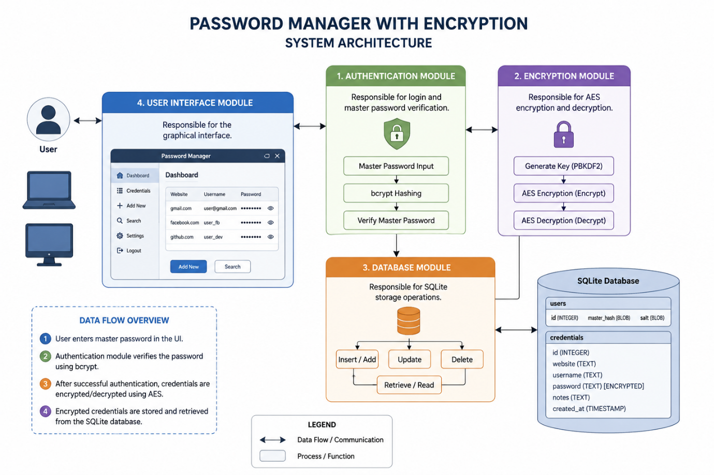
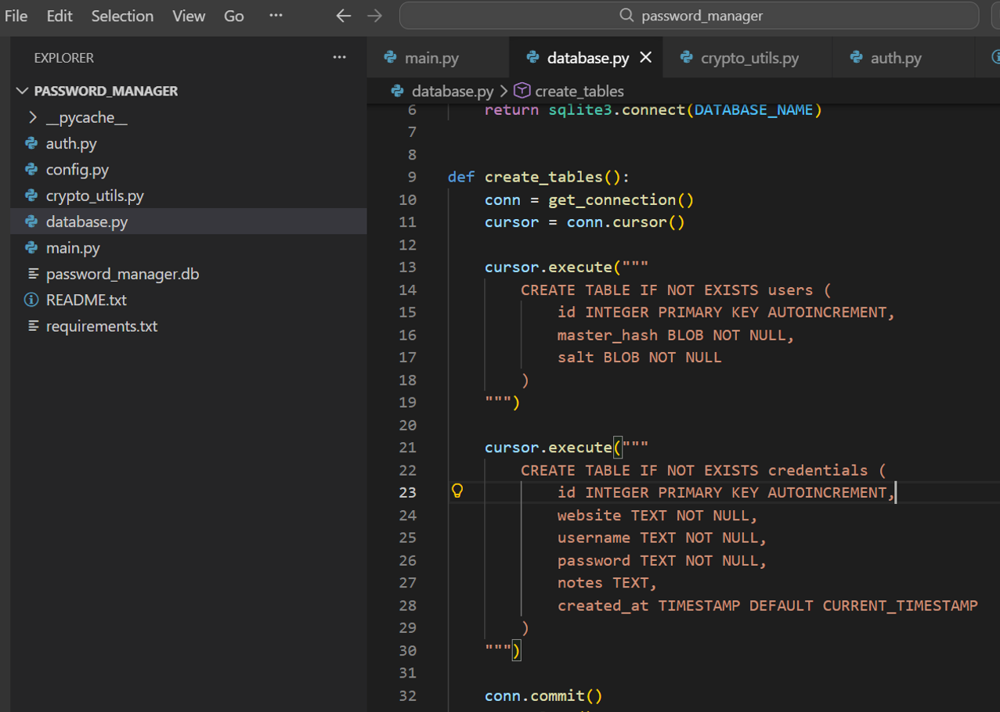
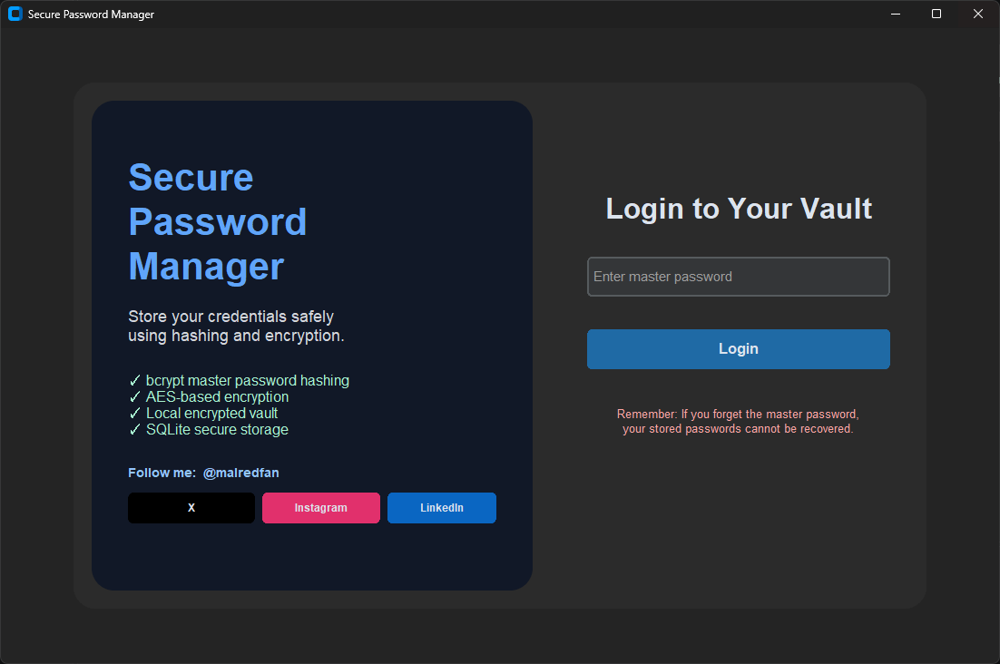
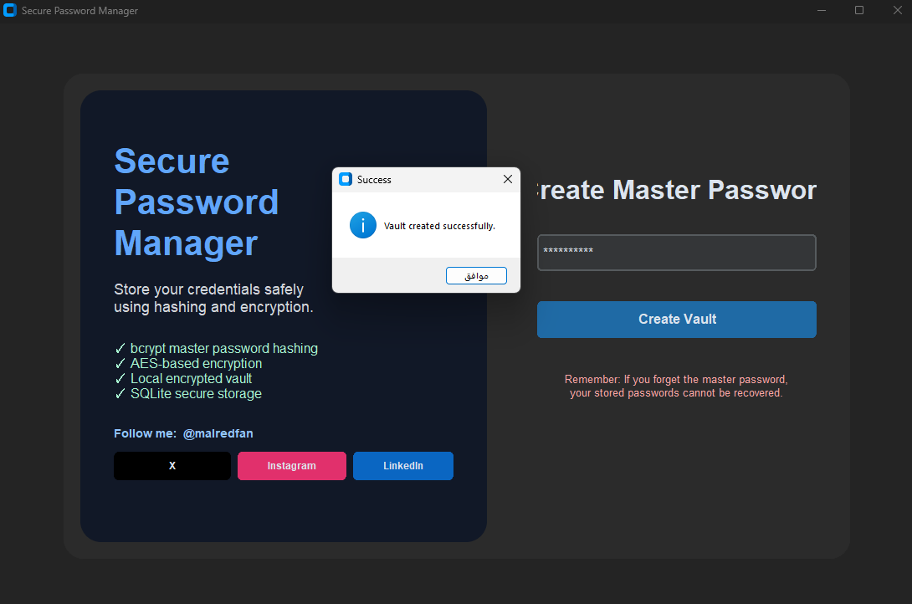
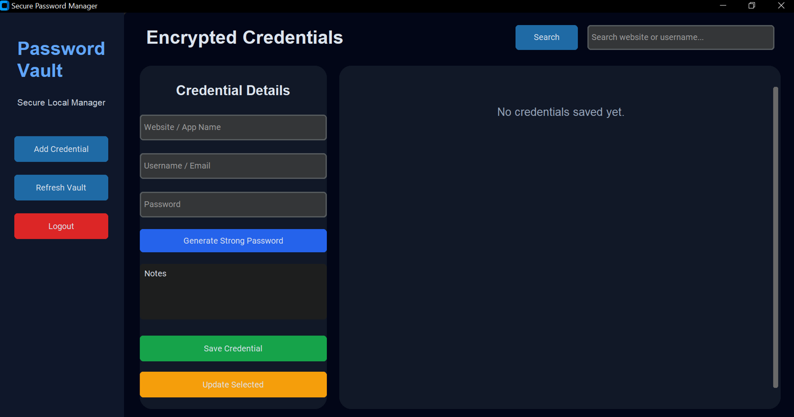
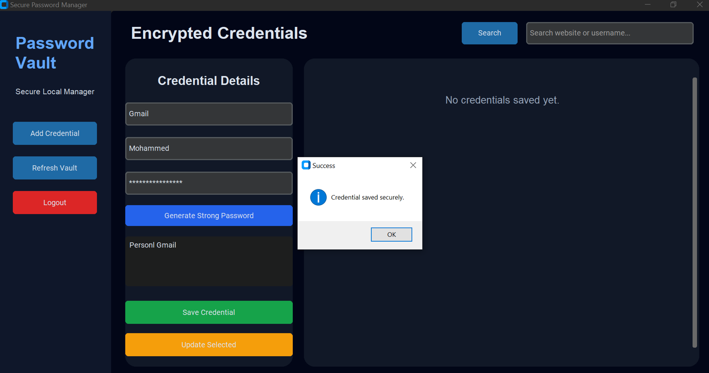
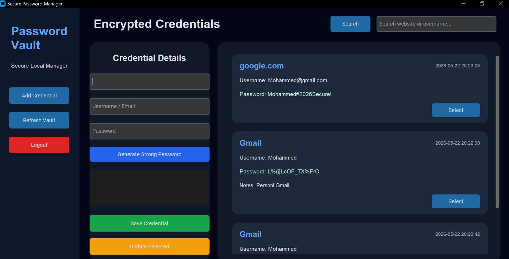
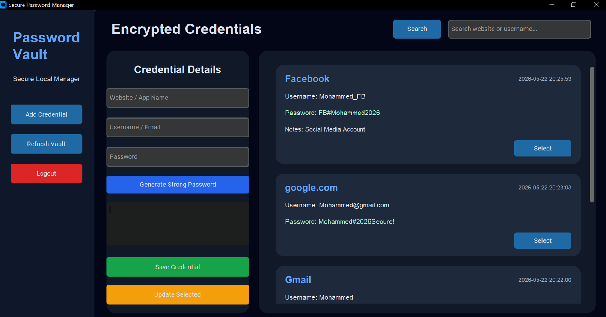
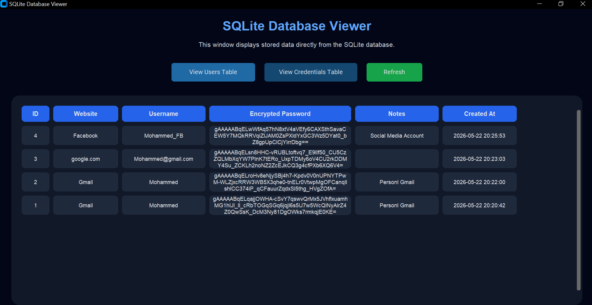
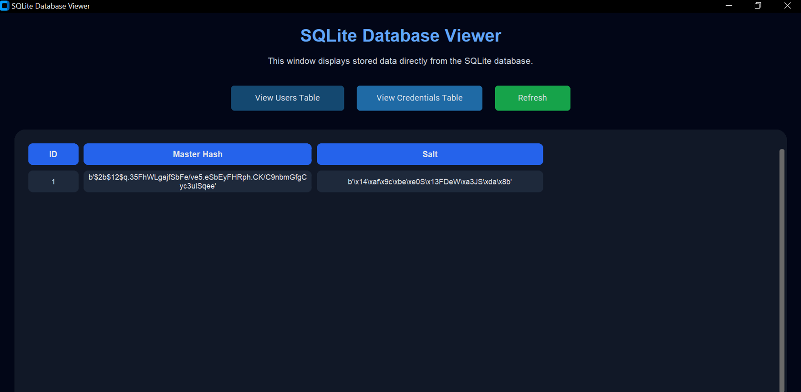

# Password Manager with Encryption

> **Disclaimer:** This project has been prepared for academic and personal purposes only, and represents the sole individual work of the author named above. No part of this project may be copied, reproduced, quoted, distributed, or used in any form — in whole or in part — without prior written permission from the author.

# Table of Contents

- [Abstract](#abstract)
- [Introduction](#introduction)
- [Problem Statement](#problem-statement)
- [Project Objectives](#project-objectives)
- [Scope of the Project](#scope-of-the-project)
- [Literature Review](#literature-review)
- [System Analysis](#️system-analysis)
- [System Design](#️system-design)
- [Technologies and Tools](#technologies-and-tools)
- [Database Design](#database-design)
- [Security Techniques Used](#security-techniques-used)
- [Implementation](#implementation)
- [Testing and Results](#testing-and-results)
- [Challenges Faced](#challenges-faced)
- [Future Improvements](#future-improvements)
- [Conclusion](#conclusion)
- [References](#references)
- [Contact](#contact)

# Abstract

This project presents a secure Password Manager application that stores user credentials inside an encrypted vault. The system uses bcrypt hashing for securing the master password and AES-based encryption for protecting stored passwords. The application includes authentication, credential management, encrypted storage, and a modern graphical user interface. The project demonstrates important cybersecurity concepts including password security, encryption at rest, salting, authentication, and secure local storage.

# Introduction

In the modern digital era, users manage many online accounts including banking systems, social media platforms, educational services, and email accounts. Managing passwords manually often leads to weak security practices such as password reuse or storing passwords in unsafe locations.

A password manager solves these problems by securely storing credentials inside an encrypted vault protected by a single master password.

This project aims to develop a secure desktop password manager using Python and modern cryptographic techniques.

# Problem Statement
Many users face difficulties managing multiple strong passwords. Common insecure practices include:
- Writing passwords in notebooks
- Saving passwords in plain text files
- Reusing the same password
- Using weak passwords

These practices increase the risk of unauthorized access and cyberattacks.
Therefore, there is a need for a secure system that can safely store passwords using encryption and authentication mechanisms.

# Project Objectives

1.	Build a secure password vault. 
2.	Protect the master password using bcrypt hashing. 
3.	Encrypt stored passwords using AES encryption. 
4.	Create a modern and user-friendly interface. 
5.	Allow users to add, update, search, and delete credentials securely. 
6.	Apply cybersecurity best practices in secure storage. 

# Scope of the Project
The project focuses on:
- Local desktop password management
- Secure authentication
- Encryption of stored credentials
- SQLite database storage
- Secure password retrieval

The project does not include:
- Cloud synchronization
- Online account registration
- Multi-user support 

# Literature Review
Password managers are widely used cybersecurity tools that help users maintain strong and unique passwords for different services. Modern password managers use cryptographic techniques such as:
- Password hashing
- AES encryption
- Key derivation
- Salting

bcrypt is considered one of the strongest password hashing algorithms because it protects against brute-force attacks.

AES encryption is widely used because of its strong security and efficiency in protecting sensitive information.

# System Analysis

### Functional Requirements
The system should:
- Authenticate users
- Encrypt passwords
- Store credentials securely
- Allow credential management
- Search stored records 

### Non-Functional Requirements
The system should:
- Be secure
- Be easy to use
- Have fast response time
- Provide data confidentiality
- Prevent unauthorized access 

# System Design
### System Architecture
The system consists of four main modules:
1. Authentication Module
Responsible for login and master password verification.
2. Encryption Module
Responsible for AES encryption and decryption.
3. Database Module
Responsible for SQLite storage operations.
4. User Interface Module
Responsible for the graphical interface.

# Technologies and Tools

| Technology | Purpose |
|---|---|
| Python | Main programming language |
| SQLite | Local database |
| bcrypt | Password hashing |
| Cryptography Library | AES encryption |
| CustomTkinter | Modern graphical UI |
| PBKDF2 | Key derivation |

# Database Design
### Table: users
| Field | Type |
|---|---|
| id | INTEGER |
| master_hash | BLOB |
| salt | BLOB |

### Table: credentials
| Field | Type |
|---|---|
| id | INTEGER |
| website | TEXT |
| username | TEXT |
| password | TEXT |
| notes | TEXT |
| created_at | TIMESTAMP |

# Security Techniques Used
### Password Hashing
The master password is hashed using bcrypt before storage, Example:
bcrypt.hashpw(password.encode(), bcrypt.gensalt())
This prevents storing plain-text passwords.

### Salting
A random salt is generated for each user to increase password security and prevent rainbow table attacks.

### AES Encryption
All stored credentials are encrypted before being saved in the database.
Encrypted passwords cannot be read directly from the database.

### Encryption at Rest
All passwords remain encrypted while stored locally.

# Implementation
### Step 1 — Creating the Database
The SQLite database was created with two tables:
- users
- credentials

### Step 2 — Creating the Login Screen
The application starts with a secure login screen.

### Step 3 — Master Password Authentication
bcrypt hashing is used for verifying the master password.

### Step 4 — Main Dashboard
The dashboard allows users to manage credentials securely.

### Step 5 — Adding Credentials
Users can add website credentials securely.

### Step 6 — Password Generation
The application includes a strong password generator.

### Step 7 — Viewing Stored Credentials
Credentials are decrypted only after successful login.

### Step 8 — Encrypted Database Storage
Passwords appear encrypted inside SQLite.

# Testing and Results
### Functional Testing
| Test Case | Result |
|---|---|
| User Login | Passed |
| Password Encryption | Passed |
| Add Credential | Passed |
| Update Credential | Passed |
| Delete Credential | Passed |
| Search Function | Passed |
| Password Generator | Passed |

### Security Testing
| Security Feature | Result |
|---|---|
| bcrypt Hashing | Successful |
| Salt Generation | Successful |
| AES Encryption | Successful |
| Unauthorized Access Prevention | Successful |

# Challenges Faced
Some challenges during development included:
- Managing encryption keys securely
- Designing a professional UI
- Handling password encryption/decryption
- Organizing database operations
- Preventing data corruption

# Future Improvements
Future enhancements may include:
- Cloud synchronization
- Two-factor authentication
- Browser extension support
- Mobile application version
- Biometric authentication
- Backup and recovery system

# Conclusion
The Password Manager with Encryption project demonstrates how cybersecurity concepts can be applied in a real-world application. The system securely stores credentials using hashing and encryption techniques while providing a modern user interface and secure local storage.
The project successfully achieved its objectives and provided practical implementation of important cybersecurity principles.

# References
1. [Python Official Documentation](https://docs.python.org/3/)
2. [SQLite Documentation](https://www.sqlite.org/docs.html)
3. [bcrypt Documentation](https://pypi.org/project/bcrypt/)
4. [Cryptography Library Documentation](https://cryptography.io/en/latest/)
5. [OWASP Password Storage Cheat Sheet](https://cheatsheetseries.owasp.org/cheatsheets/Password_Storage_Cheat_Sheet.html)
6. [NIST AES Encryption Standards](https://csrc.nist.gov/projects/aes)
7. [Cybersecurity Fundamentals Overview](https://www.cisa.gov/news-events/news/understanding-cybersecurity-basics)

# Contact

For questions, feedback, or support:

**Mohammed Abdulrahman Alalyani**
- Email: [malredfan@gmail.com](mailto:malredfan@gmail.com)
- Instagram: [@malredfan](https://instagram.com/malredfan)
- X: [@malredfan](https://x.com/malredfan)
- LinkedIn: [malredfan](https://linkedin.com/in/malredfan)
